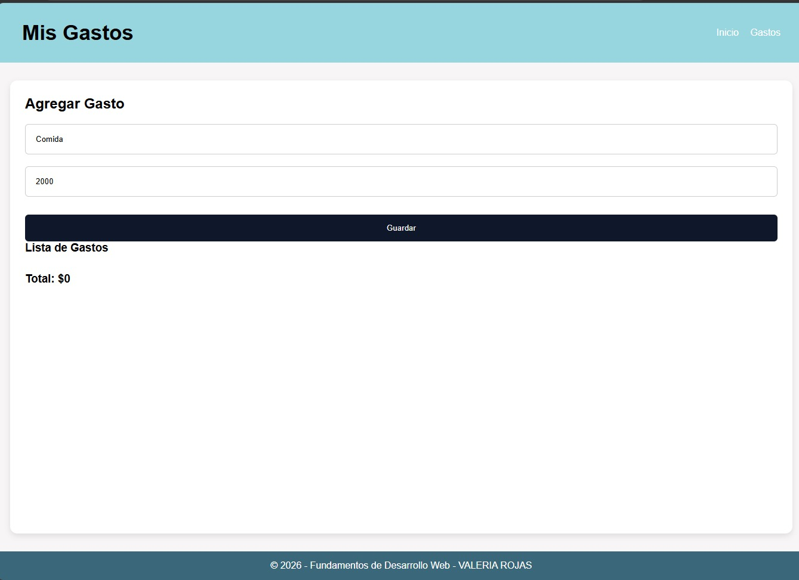
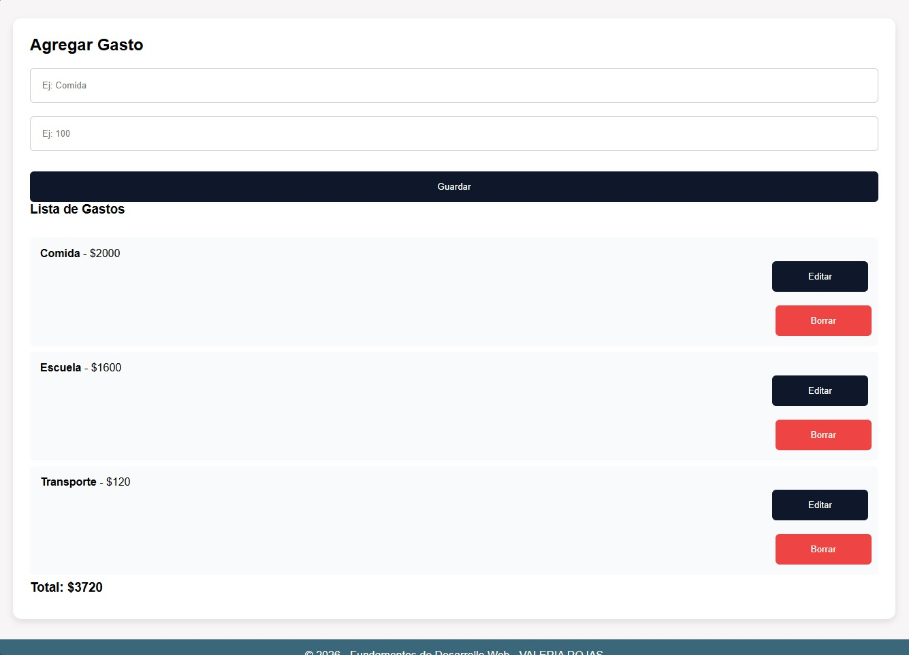
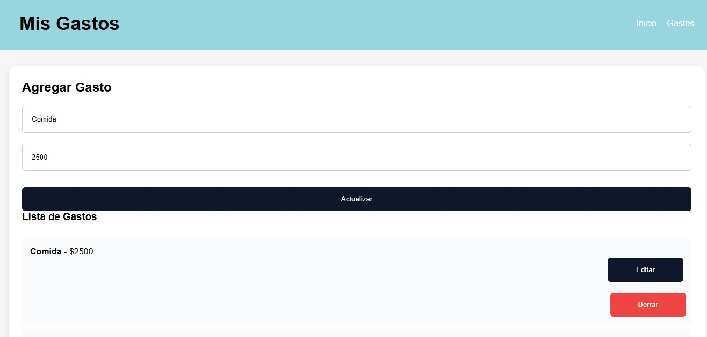
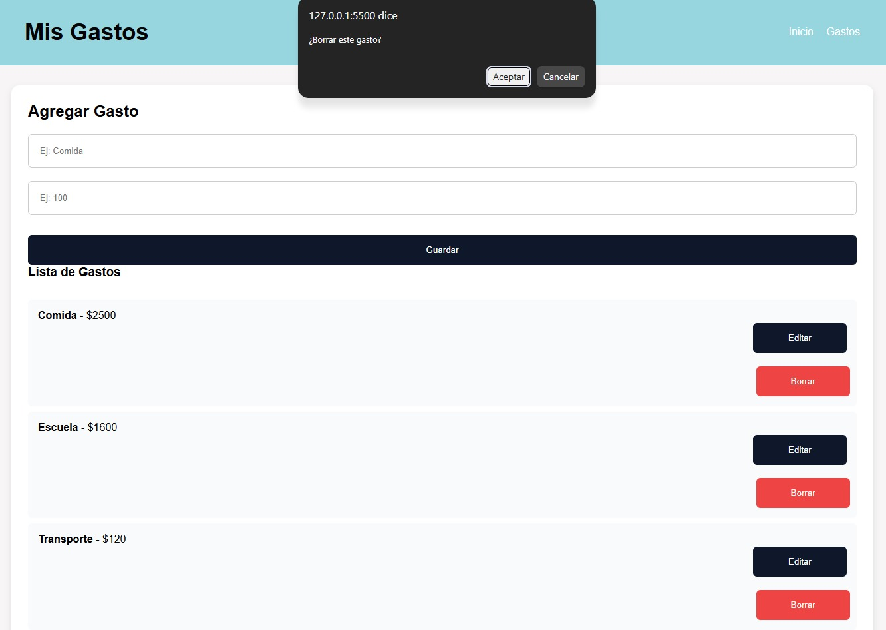

DOCUMENTACIÓN - Gestor de Gastos
Alumna: Valeria Rojas1. 
Evidencias de funcionamiento CRUD:
Crear: Se ingresa concepto y monto en el formulario y se guarda con localStorage.
Leer: Al cargar la página se leen los gastos de localStorage y se muestran en tabla.
Editar: Botón Editar carga el dato al formulario para modificarlo.
Borrar: Botón Borrar elimina el registro con confirmación.

2. Retos encontrados:
Activación de GitHub Pages desde Settings > Pages > Deploy from branch (main/root).
Al inicio Google Safe Browsing marcó el sitio github.io como peligroso por ser dominio nuevo, se resolvió con reporte de
falso positivo y se quitó solo en 12 horas.
Persistencia de datos sin backend, resuelto con localStorage de JavaScript.

3. Mejoras implementadas:
4. Diseño responsivo con CSS Grid/Flex.
5. Validación de campos vacíos y montos negativos.
6. Cálculo automático
de total de gastos.
Footer personalizado con nombre y matrícula.

4. Links de entrega:
5. Repositorio: https://github.com/Valeria0230/Gestor-de-Gastos
6. Sitio en vivo: https://valeria0230.github.io/Gestor-de-Gastos/

## Evidencias CRUD

### CREAR

### LEER

### EDITAR / ACTUALIZAR

### BORRAR

